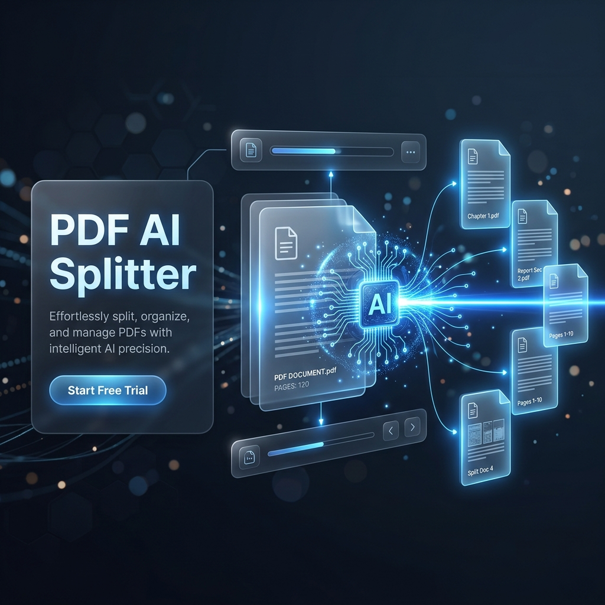

# ✂️ PDF AI Splitter

  

  <strong>Intelligent and lightning-fast PDF splitting powered by AI (OCR).</strong>

  

---

### 🔴 IMPORTANT: COMPATIBILITY
**This application is designed and optimized EXCLUSIVELY for the WINDOWS operating system.** It uses system PowerShell scripts and specific OCR tool installers dedicated to this platform.

---

## 💡 About the Project

**PDF AI Splitter** was created to solve the problem of tedious management of huge PDF files. If you've ever had to "manually" cut invoices from a 500-page batch file, this tool is for you.

By combining **FastAPI (Python)** and **Next.js**, the application allows for:
- **Automatic Section Recognition**: The Tesseract OCR engine scans text and suggests split points.
- **Visual Management**: Intuitive 3-column preview with the ability to rename files "on the fly".
- **Local-First**: All operations (OCR, PDF cutting) take place on your computer. Your data is safe and private.

## 🛠️ Tech Stack

| Layer | Technologies |
| :--- | :--- |
| **Frontend** |   |
| **Backend** |   |
| **OCR Engine** | Tesseract OCR 5.4 |
| **Installation** | PowerShell & Batch Automation |

## 🚀 Quick Installation

You don't need to configure the environment manually. We have prepared an automatic installer:

1. Download the [Setup-PDF-Splitter.bat](https://github.com/ArturGilowski/PDFsplitter/raw/main/docs/Setup-PDF-Splitter.bat) file.
2. Run it as **Administrator**.
3. The script will automatically download the necessary components and create a **PDF Splitter** shortcut on your desktop.

---

### 🔧 Information for Developers

If you want to run the project locally in development mode:
1. Configure backend: `cd backend && python -m venv venv && .\venv\Scripts\activate && pip install -r requirements.txt`
2. Configure frontend: `cd frontend && npm install`
3. Start servers: `.\run-servers.bat`

---

  Created by <b>Artur Gilowski</b>. All rights reserved © 2026.

---
---

# ✂️ PDF AI Splitter (Wersja Polska)

  <strong>Inteligentne i błyskawiczne dzielenie plików PDF z mocą AI (OCR).</strong>

  

---

### 🔴 UWAGA: KOMPATYBILNOŚĆ
**Aplikacja została zaprojektowana i zoptymalizowana WYŁĄCZNIE dla systemu operacyjnego WINDOWS.** Korzysta ona z systemowych skryptów PowerShell oraz specyficznych instalatorów narzędzi OCR dedykowanych dla tego systemu.

---

## 💡 O Projekcie

**PDF AI Splitter** powstał, aby rozwiązać problem żmudnego zarządzania ogromnymi plikami PDF. Jeśli kiedykolwiek musiałeś "ręcznie" wycinać faktury ze zbiorczego pliku liczącego setki stron, to narzędzie jest dla Ciebie. 

Dzięki połączeniu **FastAPI (Python)** oraz **Next.js**, aplikacja pozwala na:
- **Automatyczne rozpoznawanie sekcji**: Silnik Tesseract OCR skanuje tekst i sugeruje punkty podziału.
- **Wizualne zarządzanie**: Intuicyjny podgląd 3-kolumnowy z możliwością nazywania plików "w locie".
- **Local-First**: Wszystkie operacje (OCR, cięcie PDF) odbywają się na Twoim komputerze. Twoje dane są bezpieczne i prywatne.

## 🛠️ Stack Techniczny

| Warstwa | Technologie |
| :--- | :--- |
| **Frontend** |   |
| **Backend** |   |
| **Silnik OCR** | Tesseract OCR 5.4 |
| **Instalacja** | PowerShell & Batch Automation |

## 🚀 Szybka Instalacja

Nie musisz konfigurować środowiska ręcznie. Przygotowaliśmy automatyczny instalator:

1. Pobierz plik [Setup-PDF-Splitter.bat](https://github.com/ArturGilowski/PDFsplitter/raw/main/docs/Setup-PDF-Splitter.bat).
2. Uruchom go jako **Administrator**.
3. Skrypt sam pobierze potrzebne komponenty i stworzy skrót **PDF Splitter** na Twoim pulpicie.

---

### 🔧 Informacje dla Deweloperów

Jeśli chcesz uruchomić projekt lokalnie w trybie deweloperskim:
1. Skonfiguruj backend: `cd backend && python -m venv venv && .\venv\Scripts\activate && pip install -r requirements.txt`
2. Skonfiguruj frontend: `cd frontend && npm install`
3. Uruchom serwery: `.\run-servers.bat`

---

  Stworzone przez <b>Artur Gilowski</b>. Wszystkie prawa zastrzeżone © 2026.

---
